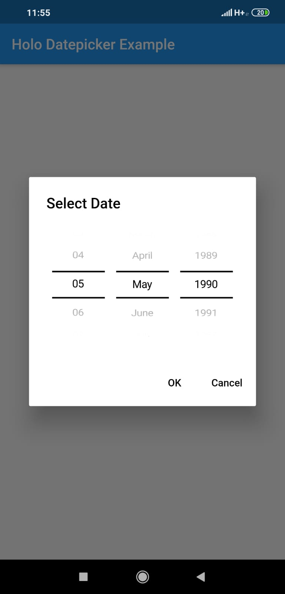
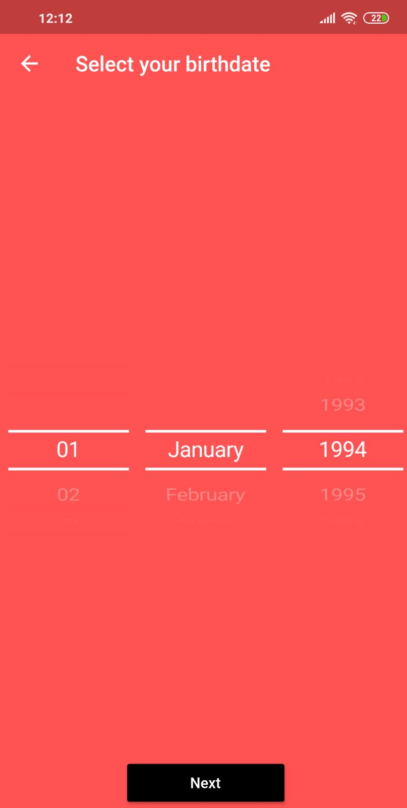

# flutter_holo_date_picker

 A Flutter package of Datepicker inspired by the Holo Theme in Android.

## Getting Started

This plugins displays a Datepicker inspired by the Holo Theme in Android.
based on the [flutter_cupertino_date_picker package](https://pub.dev/packages/flutter_cupertino_date_picker)

See the example for simple use :)

## Screenshots

## Locales Supported
- English (EN) United States
- Chinese (ZH) Simplified
- Portuguese (PT) Brazil
- Spanish (ES)
- Romanian (RO)
- Bengali (BN)
- Arabic (AR)
- Japanese (JP)
- Russian (RU)
- German (DE)
- Korea (KO)
- Italian (IT)
- Hungarian (HU)
- Hebrew (HE)
- Indonesian (ID)
- Turkish (TR)
- Norwegian (NO)
- French (FR)
- Thai (TH)
- Lithuanian (LT)
- Dutch (NL)
- Haitian Creole (HT)
- Swedish (SV)
- Czech (CZ)
- Polish (PL)
